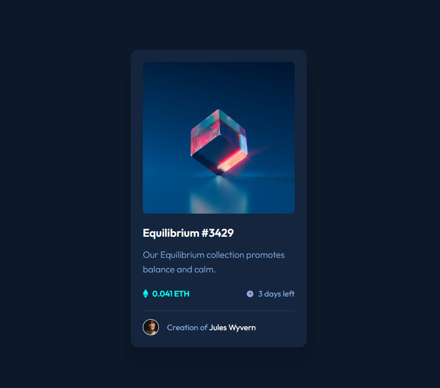

# NFT Preview Card Component

## 🎯 Sobre o Projeto

Um componente de preview de NFT responsivo desenvolvido com HTML e CSS, seguindo um design moderno com efeitos hover interativos.

## 🖼️ Preview do Projeto



## ✨ Funcionalidades

✅ Design 100% responsivo para todos os dispositivos  
✅ Efeitos hover com overlay e ícone de visualização  
✅ Layout semântico e acessível  
✅ Tipografia customizada com a fonte Outfit  
✅ Sombras realistas e bordas arredondadas  
✅ Transições suaves e animações CSS

## 🛠️ Tecnologias Utilizadas

- **HTML5** - Estrutura semântica
- **CSS3** - Estilização moderna
- **Flexbox** - Layouts flexíveis
- **Media Queries** - Responsividade
- **Pseudo-elementos** - Efeitos hover avançados
- **Transitions** - Animações suaves
- **Variáveis CSS** - Cores consistentes

## 🎨 Características do Design

**Cores:**

- Fundo principal: `hsl(217, 54%, 11%)`
- Card: `hsl(216, 50%, 16%)`
- Linha divisória: `hsl(215, 32%, 27%)`
- Texto principal: `hsl(0, 0%, 100%)`
- Texto secundário: `hsl(215, 51%, 70%)`
- Destaque: `hsl(178, 100%, 50%)`

**Tipografia:** Outfit (300, 400, 600)  
**Layout:** Card centralizado com sombras múltiplas

## 📱 Responsividade

O projeto é totalmente responsivo com breakpoints para:

- **Desktop:** 1440px+
- **Tablet:** 768px
- **Mobile:** 375px

## 🚀 Como Executar

```bash
# Clone o repositório
git clone https://github.com/seu-usuario/nft-preview-card.git

# Abra o arquivo index.html no navegador
# ou use uma extensão Live Server no VS Code
```
